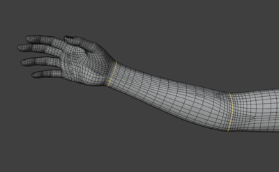
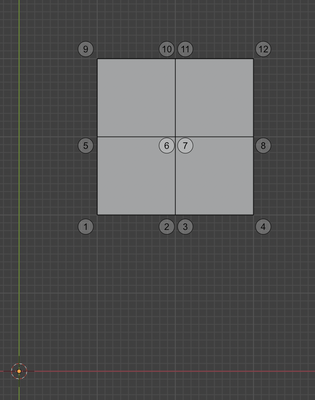
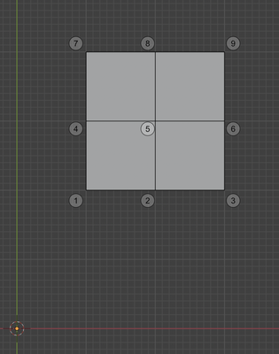

# poser-panel

A Blender __add-on__ to help working with Poser exported OBJ files in Blender.

## Summary

Using 2 OBJ files of the same *exact* mesh shape but with different vert orders and/or counts, creates a map that can be used to transfer shapes between a second pair with the same vert orders and face structures as the first pair.

## Reason for this Add-on

I wanted to use Blender for sculpting Poser Figure morphs.  In Poser and Daz Studio (DS), a Full Body Morph (FBM) can be made by loading an OBJ file with the same vertex and face structure as the source OBJ, but with different vertex x,y,z values.  That's the essence of a morph: alternate positions for the vertexes.

## Problem

### Overview

Poser exports a mesh as an OBJ which can't be used as a morph in either Poser or DS.  This is because Poser does not export a mesh with the same structure as the original OBJ; the vertex order is different. Even when welded  (ie: the vertex count is made the same as the original) into a single mesh (aka: unimesh).

### Details

#### OBJ Format

In Object files, vertexes are defined in a plain text file (eg: mesh.obj) with one vertex per line, defined as:

<pre>
v x,y,z
</pre>

The vertex index, v[i], is just a counter that increments for each "v" line read sequentially from the text file.

As in:

<pre>
  v 2,6,3
  v 2,9,1
  v 4,67,2
</pre>

with the indexes being 1, 2, and 3 reaspectively; for v[1], v[2], v[3].

#### Meshes 

Every application represents meshes internally using different programmatic structures.  But the basis for any mesh in any application is still a collection of vertexes; every mesh has a vertex list.  And that list has some form of index.  The vertex lists may be kept in different forms, internal to the application.  Which means that the index is likely maintained using different methods.  It may be a propery of a Vertex Object.  It may be it's position in a list of vertexes.  In OBJ format, we see the index comes from the vertex sequential position in the vertex list.

To solve this problem, no matter how the internal format is stored, what matters is that the order from the original OBJ file can be reconstructed when the mesh is exported back as an OBJ.
 
- Daz Studio can export an mesh in the original OBJ order
- Blender can export an mesh in the original OBJ order
- Poser __CANNOT__ export a mesh in the original OBJ order

Since the vertex order of an OBJ to be used as a FBM must be the same as the original OBJ, you can never use a Poser exported figure mesh, in an OBJ format that can be used by anything (even by Poser) as a source for a FBM.

### Analysis

When Poser makes an internal mesh object from that original unimesh OBJ, it splits the mesh into several sub-meshes and orders the vertexes differently.  When it exports that internal mesh object, the resulting OBJ has a different vertex order than the source file.

__Note:__
<ul>
This would not really be a problem if Poser simply put the vertexes back into the original order when it exports the mesh as an OBJ.  But, while it *could* have saved a map of Poser vertex indexes to original vertex indexes and use that to reconstitute an originally ordered vertex OBJ upon export, it did *not* save that information.  A lost opportunity and something that could be fixed in Poser.  Just sayin'
</ul>

 "Arm area of a Figure's mesh"

Different than 3D applications such as Blender or DS, Poser structures a *Figure* as a group of disconnected submeshes, one submesh attached to each actor (bone).

__Note:__
<ul>
Poser was written before this sort of 3D application was common and it fundamentally depends on its way of doing this.  Re-writing Poser to use the different method of rigging (ie: unimesh) is not trivial.
</ul>

 "Forearm sub-mesh of the Arm"

For each actor that joins to another actor, the common mesh edge is shared; that is, the vertexes that make up the shared edge are duplicated in each submesh and logically "welded" by Poser.  During figure creation, when Poser splits the original unimesh, those shared vertexes are doubled.  Once for each sub-mesh.

 "Forearm edges shared with other sub-meshes (in this case, Hand and Shoulder)"

### Question
Given that Poser did not save a vertex map to allow reconsitution of the original OBJ structure, what's to be done?

### Answer

We need only two things to recreate the original OBJ structure with a Poser ordered shape for that mesh:

- A mapping from original vertex indexes (vo[i]) to Poser vertex indexes (vp[i]).
- A way to use that info to create an original vertex ordered OBJ *but* with the shape of the Poser vertex ordered OBJ.

## Solution
This Add-on uses some of the characteristics of Poser export, OBJ files, and Blender OBj import/export to help provide an answer.

- Poser exports a zero'd mesh with the vertexes all in the same exact xyz positions as the source OBJ but a different vertex order.  You don't even need the same number of verts. But you do need the polygroups (ie: Actors) and it's also handy to have the material groups, which helps with complex selections in Blender.
- Poser exports the same mesh the same way, every time.  Not in the original order.  But in Poser's order, the same each time.
- Blender imports an OBJ maintaining the source order, UVs, and mats. It imports OBJ polygroups as Blender vertex groups.
- Blender saves an OBJ with vertexes in the same order as its internal Object.  For Objects that came from an OBJ import, the vertexes are written in the same order as the imported OBJ

So, if we have a source OBJ, and a Poser exported OBJ with unchanged vertexes, we can compare them and find a mapping between one vert order and the other in Blender.

This add-on uses Python dictionaries and lists to do so.  In some languages, dictionaries are known as associative arrays.  In Python, dicts can be keyed using tuples.  A tuple is a list of numbers separated by commas.  As in the x,y,z of a vertex; eg: (2,5,1).  A dictionary entry with a list of indexes might look like:

<ul>
  dict(2,5,1)=[v[34],v[21]]
</ul>

Which would mean that both vertex 21 and vertex 34 have position x=2, y=5, and z=1

If we have an original OBJ and a Poser OBJ (that is zero'd and came from that original OBJ), then a dict keyed on each vertex (x,y,z) with be the same!  That is, for every vertex(x,y,z) of the first OBJ, there will be exactly one vertex(x,y,z) of the second OBJ *and* vice versa.

In short, the list of keys from one OBJ will be equal to the list of keys for the second OBJ.

If we store the indexes of the vertexes in a positionally keyed dictionary, we can make a map between mesh indexes!

### Example

3 meshes, in 2D with simple x and y's to keep it brief, clear, and simple.  We'll be using the indexes, directly, to represent the vertex positions.  In reality, the vertexes are actually a class that has (x,y,z) positions.  Those positions are used to make INT based (X,Y,Z) dictionaries of the Vertex indexes.

- Mesh 1 and Mesh 2 are the same shape BUT different vert order and number of points.
- Mesh 2 and 3 are the same vert order and number of points BUT different shapes

We will use all this to make the first mesh look like the third mesh.  How we would use this, in reality, is to make a Poser exported OBJ with morph(s) into a shaped version of the original OBJ, suitable for using directly as a morph in DS or Poser, or sculpting in Blender then exporting and an OBJ suitabkle for use as a morph in either

__mesh 1__

A 2x2 face unimesh, 9 verts

 "Mesh 1"

| index | position |
| --- | --- |
| 1 | 0,0 |
| 2 | 1,0 |
| 3 | 2,0 |
| 4 | 0,1 |
| 5 | 1,1 |
| 6 | 2,1 |
| 7 | 0,2 |
| 8 | 1,2 |
| 9 | 2,2 |

__mesh 2__

A split version of the same mesh; ie: same shape, different verts (two 1x2 meshes, with a shared edge up the middle, 12 vertexes)

 "Mesh 2"

| index | position |
| --- | --- |
| 1 | 0,0 |
| 2 | 1,0 |
| 3 | 1,0 |
| 4 | 2,0 |
| 5 | 0,1 |
| 6 | 1,1 |
| 7 | 1,1 |
| 8 | 2,1 |
| 9 | 0,2 |
| 10 | 1,2 |
| 11 | 1,2 |
| 12 | 2,2 |

A dictionary of the first mesh, key=x,y value=index list (ie: indexes with this key)
<ul>
  mesh1(0,0) = [1]
  mesh1(1,0) = [2]
  mesh1(2,0) = [3]
  mesh1(0,1) = [4]
  mesh1(1,1) = [5]
  mesh1(2,1) = [6]
  mesh1(0,2) = [7]
  mesh1(1,2) = [8]
  mesh1(2,2) = [9]
</ul>

A dictionary of the second mesh, key=x,y value=index list (ie: indexes with this key)

<ul>
  mesh2(0,0) = [1]
  mesh2(1,0) = [2,3]
  mesh2(2,0) = [4]
  mesh2(0,1) = [5]
  mesh2(1,1) = [6,7]
  mesh2(2,1) = [8]
  mesh2(0,2) = [9]
  mesh2(1,2) = [10,11]
  mesh2(2,2) = [12]
</ul>

This gives us the map we need!  Starting with a mesh 2 vertex or index 7, we get the key of (1,1).  Then we look at Mesh1(1,1) and get it's index of 5.  Index 7 (and index 6, since those vertexes are "welded") in the second mesh corresponds to index 5 of the first mesh.

Nice.

Now, if we have a third mesh that has the same vert order as that second mesh (that is index1 of the first = index1 of the second, etc.) We can use that map to impose the shape of the third mesh ON the first mesh, mapping *through* mesh 2 (reemember: the Poser exported ZERO version of the orignal)

__mesh 3__

A mesh with the same vert order as the second, BUT with different shape.  In this case, shifted by 1 in x and 2 in y

 "Mesh 3"

| index | position |
| --- | --- |
| 1 | 1,2 |
| 2 | 2,2 |
| 3 | 2,2 |
| 4 | 3,2 |
| 5 | 1,3 |
| 6 | 2,3 |
| 7 | 2,3 |
| 8 | 3,3 |
| 9 | 1,4 |
| 10 | 2,4 |
| 11 | 2,4 |
| 12 | 3,4 |

Resulting dict
<ul>
  mesh2(1,2) = [1]
  mesh2(2,2) = [2,3]
  mesh2(3,2) = [4]
  mesh2(1,3) = [5]
  mesh2(2,3) = [6,7]
  mesh2(3,3) = [8]
  mesh2(1,4) = [9]
  mesh2(2,4) = [10,11]
  mesh2(3,4) = [12]
</ul>

Now, to make the first mesh have the same shape as this.

For each vert in the third mesh, we get it's key.  That's it's (x,y).  We'll want to move the correct index in Mesh 1 to that (x,y).  So we find the key for this third index in the second mesh (it's the same index).  Then use *that* key in the first mesh to find the index of the vertex.  We set the vert at that index to the same (x,y) as the third mesh.

Index 1 of third mesh.  Gives us an (x,y) of (1,2).  In mesh2, that same index has a key of (0,0).  Mesh1(0,0) gives us an index of 1.  
So we set index 1 to the (x,y) of mesh 3.  Repeating for each vertex, we get a Mesh 4 that looks like.

__Mesh 4__

A mesh with the structure of Mesh 1 and the shape of Mesh 3.

 "Mesh 4"

| index | position |
| --- | --- |
| 1 | 1,2 |
| 2 | 2,2 |
| 3 | 3,2 |
| 4 | 1,3 |
| 5 | 2,3 |
| 6 | 3,3 |
| 7 | 1,4 |
| 8 | 2,4 |
| 9 | 3,4 |

This is an OBJ with the same structure as __mesh1__, but with the shape of __mesh 3__.  This mesh could be used as a FBM in Poser or DS for a figure that was made from __mesh 1__.  It could also be changed (edited and/or sculpted) in Blender without splitting.  Then exported as an OBJ and used in Poser or DS.

Cool.
